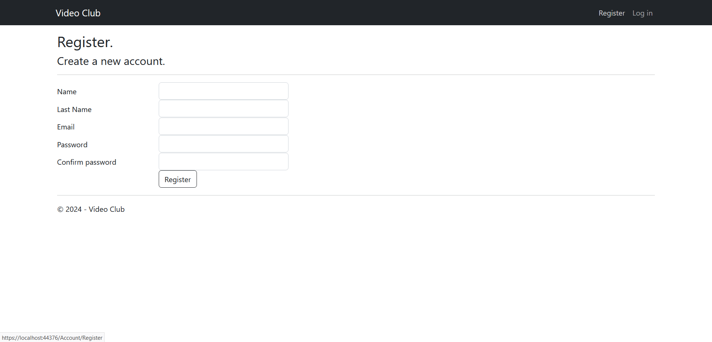
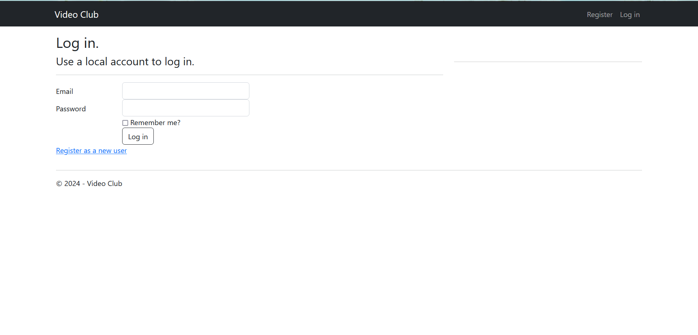
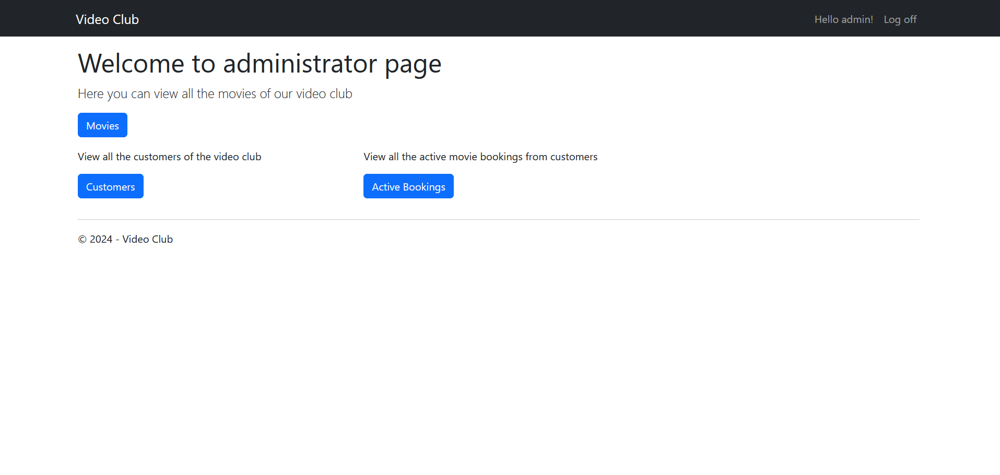
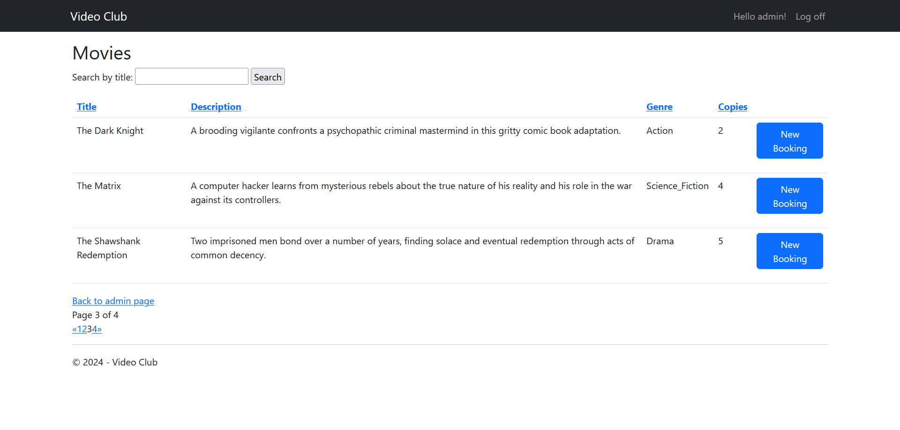
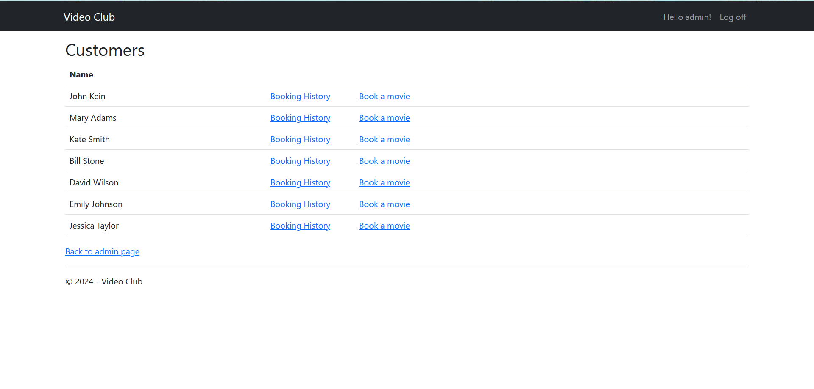
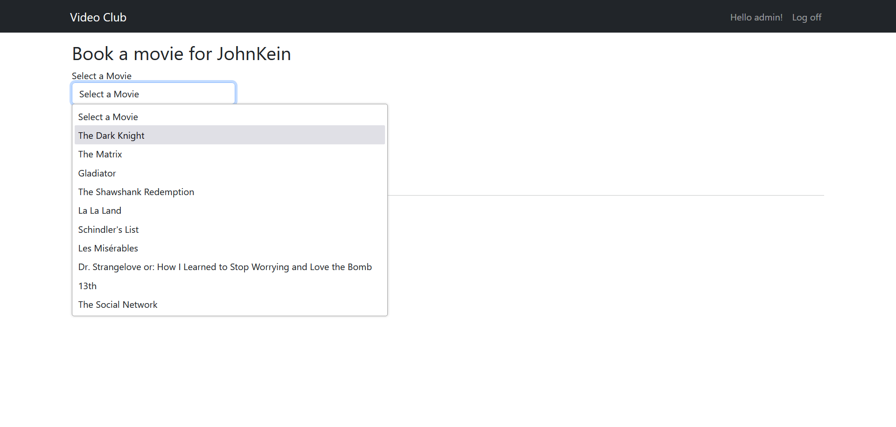
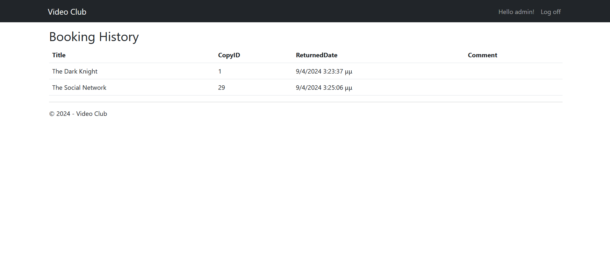
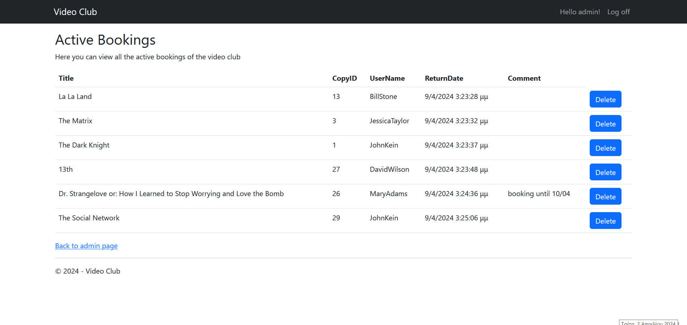
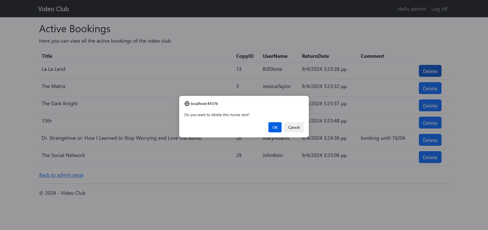
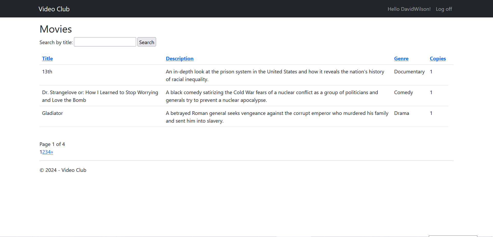

# Project Name

## Description

This project is a movie rental system where users can book movies and admins have additional functionalities such as managing bookings and movie inventory.

The basic idea is that we have roles: users and admin. Admins have additional functionalities like booking a movie for a customer, viewing the booking history of each customer, and managing the movie inventory. They can also delete bookings.

Users, on the other hand, have limited functionalities. They can only see how many available copies exist for each movie.

Screenshots:<br>

**Register page**


**Login page**


**For Admin functionality:**

<br>


**Admin home page**


**Admin movies page**


**Admin customers page**


**Admin creating new booking for a client**


**Admin watching booking history of a client**


**Admin active bookings page**


**Admin delete active booking**



**For User functionality:**

**User home page**


### Authentication

User authentication and registration are handled using **[Identity Framework](https://docs.microsoft.com/en-us/aspnet/identity/)**. This provides secure login and registration functionalities for users and admins.

### Database Access

**[Entity Framework](https://docs.microsoft.com/en-us/ef/)** is used to access the database. It provides an Object-Relational Mapping (ORM) framework that allows developers to work with databases using .NET objects. This simplifies data access and enables seamless integration with the application's business logic.


## Getting Started

These instructions will help you set up the project on your local machine for development and testing purposes.

### Prerequisites

- [Visual Studio](https://visualstudio.microsoft.com/downloads/)
- [.NET Framework](https://dotnet.microsoft.com/download/dotnet-framework)
- [Entity Framework](https://www.nuget.org/packages/EntityFramework/)

### Installing

1. Clone the repository to your local machine.
2. Open the project in Visual Studio.

### Setting up Database Migrations

To set up database migrations for your project, follow these steps:

1. Open the Package Manager Console in Visual Studio (View -> Other Windows -> Package Manager Console) and select in Default Project dropdown: VideoClub.Infrastructure.
2. Run the following script to enable migrations, create an initial migration, and update the database:

```powershell
Enable-Migrations
Add-Migration Initial -ConfigurationTypeName VideoClub.Infrastructure.Migrations.Configuration
Update-Database -ConfigurationTypeName VideoClub.Infrastructure.Migrations.Configuration
